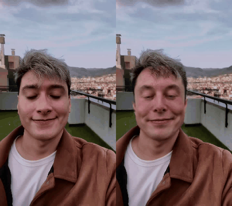
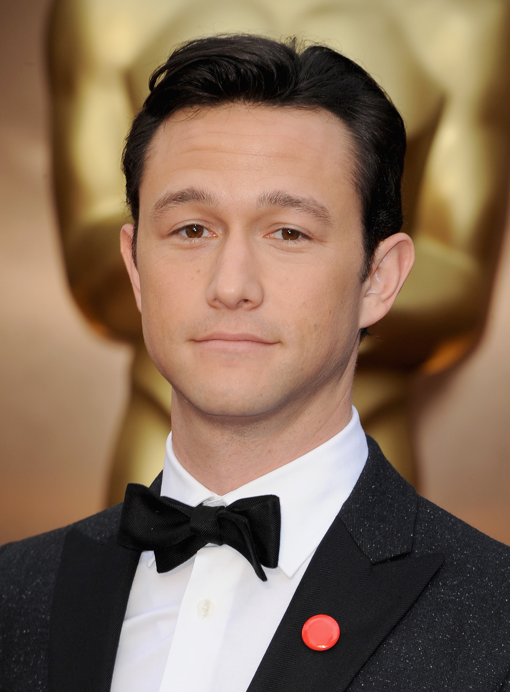
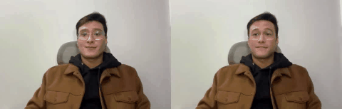

# Deepfake Face Swap

**Swap a source face onto a target video and get back both the swapped
result and a side-by-side comparison against the original — as a CLI, a
reusable Python package, or a notebook that runs the same pipeline locally
or on Google Colab.**

<p>
  
  
  
  
  
</p>

Face detection and swapping run directly through
[insightface](https://github.com/deepinsight/insightface)'s own `FaceAnalysis`
and `inswapper_128` model — no external CLI, no subprocess. This project's
own code is the glue around it — model setup, a typed pipeline, and a
comparison-video renderer — organized as an installable package instead of a
single Colab-only notebook.

## Contents

- [Preview](#preview)
- [Technologies](#technologies)
- [How it works](#how-it-works)
- [Getting started](#getting-started)
- [Optional: face restoration (--enhance)](#optional-face-restoration---enhance)
- [Notes](#notes)

## Preview

<!--
  Plain inline  tags (not a <table>) on purpose: GitHub strips <style>/media queries
  from READMEs, so a fixed-width-column table can't reflow on a narrow screen — it either
  squeezes both images tiny or forces horizontal scroll. Inline images wrap like text
  instead, so they sit side by side where there's room and stack automatically on mobile,
  each then scaled to the viewport by GitHub's own `max-width: 100%` image rule.

  Only `height` is set (no `width`): the browser derives each image's width from its own
  aspect ratio at that height, so the face and the GIF line up at the same height on
  desktop without cropping or distorting either one, and both still scale down together
  on a narrow screen.
-->

<p align="left">
  
  
</p>
<p align="left">
  <sub>Source face <code>assets/faces/demo_1/elon_musk.jpeg</code> → swapped onto
  <code>assets/videos/demo_1/sample_video.mp4</code>, original vs. swapped side by side
  (<code>assets/videos/demo_1/preview.gif</code>, rendered from
  <code>output/demo_1/combined_video.mp4</code>)</sub>
</p>

<p align="left">
  
  
</p>
<p align="left">
  <sub>Source face <code>assets/faces/demo_2/joseph-gordon.jpeg</code> → swapped onto
  <code>assets/videos/demo_2/Demo_Video_Full_Stack_Web_Developer_Introduction.mp4</code>,
  original vs. swapped side by side (<code>assets/videos/demo_2/preview.gif</code>, rendered
  from <code>output/demo_2/combined_video.mp4</code>)</sub>
</p>

Two bundled demos live side by side under `assets/`, each its own matched
video + face pair:

```
assets/
  videos/demo_1/sample_video.mp4
  faces/demo_1/elon_musk.jpeg
  videos/demo_2/Demo_Video_Full_Stack_Web_Developer_Introduction.mp4
  faces/demo_2/joseph-gordon.jpeg
```

`python main.py demo --name demo_1` (or `demo_2`) runs the full pipeline for
that pair in one command — swap, then the side-by-side comparison, then the
GIF preview — writing everything under `output/<demo>/`. Both demos resolve
their paths through the same lookup
(`deepfake_faceswap.resolve_demo_paths`), so adding a third demo is just
dropping a new `assets/videos/<name>/` + `assets/faces/<name>/` pair in
place.

You can still drive each step individually with explicit paths — see
[Getting started](#getting-started) below.

## Technologies

| Layer | Tool |
|---|---|
| Language / runtime | Python 3.9+ |
| Face-swap engine | [insightface](https://github.com/deepinsight/insightface) (`FaceAnalysis` + `inswapper_128`, called directly, in-process) |
| Video / image processing | OpenCV (`opencv-python`) |
| Notebook preview | IPython + Pillow (inline frame preview, Colab- and Jupyter-compatible) |
| CLI | `argparse` (`main.py setup` / `swap` / `combine` / `gif` / `demo`), also runnable via `npm run` |
| Interactive use | Jupyter / Google Colab (`notebooks/deepfake_faceswap_demo.ipynb`) |

## How it works

The pipeline is three independent, composable steps:

1. **Environment setup** (`environment_setup.py`) — downloads the
   `inswapper_128` ONNX model into `models/`. Idempotent: safe to call again
   once the model is already present.
2. **Face swap** (`face_swap.py`) — runs insightface's `FaceAnalysis`
   directly, in-process, to detect a face in the source image and in every
   frame of the target video, then swaps it in with the `inswapper_128`
   model. GPU (`--execution-provider cuda`) or CPU. The frames are written to
   a silent video first (OpenCV's `VideoWriter` carries no audio), then the
   target video's original audio track is muxed back in via ffmpeg (bundled
   through `imageio-ffmpeg`, no system install required). A target video
   longer than `--max-seconds` (default 15) is trimmed to that length first —
   per-frame swapping is too slow on CPU to be practical on a multi-minute
   video. Alignment landmarks are smoothed across frames by default
   (`--stabilize`, cheap) to cut down on flicker, and swapped faces can
   optionally be run through GFPGAN afterwards (`--enhance`, off by default)
   to restore detail lost to `inswapper_128`'s 128x128 output resolution —
   see [Optional: face restoration](#optional-face-restoration-enhance) below.
3. **Video compositing** (`video_compositor.py`) — reads the per-frame
   swapped images and the original video, and writes a new video with the
   two placed side by side for a visual, frame-aligned comparison. The same
   module can also render any video as a downsampled, resized animated GIF
   — handy for a README preview that plays inline on GitHub.

The CLI (`main.py`) and the notebook
(`notebooks/deepfake_faceswap_demo.ipynb`) are both thin wrappers over
these three steps — pick whichever fits how you want to run it.

## Getting started

### Requirements

- Python 3.9+
- `curl` (to download the swap model) — preinstalled on macOS and most Linux distros

### 1. Install this project's dependencies

```bash
python3 -m venv .venv && source .venv/bin/activate
pip install -r requirements.txt
```

### 2. One-time setup: download the swap model

```bash
python main.py setup   # downloads inswapper_128.onnx (~550MB) into models/
```

### 3. Run a demo end to end

Pick the execution provider for your hardware: `cuda` needs an NVIDIA GPU;
use `cpu` otherwise (e.g. on macOS, or any machine without CUDA) — it works
everywhere but is noticeably slower.

```bash
python main.py demo --name demo_1 --execution-provider cpu
# or: python main.py demo --name demo_2 --execution-provider cpu
```

This resolves the demo's video/face pair under `assets/`, runs the swap,
renders the side-by-side comparison video, and renders the GIF preview — all
in one command, written to `output/demo_1/` (or `output/demo_2/`).

### Or: via npm scripts

`package.json` wraps the same CLI commands as `npm run` scripts (no Node
dependencies — they just shell out to `.venv/bin/python main.py ...`):

```bash
npm run setup
npm run demo_1
npm run demo_2
npm run swap -- --target ... --source ... --output ...   # extra flags after --
npm run combine -- --frames-dir ... --source-video ... --output ...
npm run gif -- --video ... --output ...
```

### Or: run each step yourself with explicit paths

```bash
python main.py swap \
    --target assets/videos/demo_1/sample_video.mp4 \
    --source assets/faces/demo_1/elon_musk.jpeg \
    --output output/demo_1/output.mp4 \
    --execution-provider cpu

python main.py combine \
    --frames-dir output/demo_1/frames/sample_video \
    --source-video assets/videos/demo_1/sample_video.mp4 \
    --output output/demo_1/combined_video.mp4

python main.py gif \
    --video output/demo_1/combined_video.mp4 \
    --output output/demo_1/preview.gif \
    --fps 10 --width 480
```

### Or: run it as a notebook

```bash
jupyter notebook notebooks/deepfake_faceswap_demo.ipynb
```

It runs the same steps and works both locally and on Google Colab (it
auto-detects Colab and offers a Google Drive mount step for Drive-hosted
assets). Set `DEMO_NAME` to `"demo_1"` or `"demo_2"` to pick which bundled
demo to run — it resolves paths through the same `resolve_demo_paths`
lookup the CLI's `demo` subcommand uses. Its swap cell defaults to
`execution_provider="cpu"` — change it to `"cuda"` if a GPU is available
(e.g. on Colab).

## Optional: face restoration (--enhance)

`inswapper_128` swaps at a fixed 128x128 resolution and upscales back, which
leaves the swapped face visibly softer than the rest of the frame. `--enhance`
runs each swapped frame through [GFPGAN](https://github.com/TencentARC/GFPGAN)
afterwards to restore that detail.

It's opt-in and heavy — skip this entirely unless you want it:

```bash
pip install -r requirements-enhance.txt   # pulls in PyTorch, ~1GB with deps
python main.py setup --enhancer           # downloads GFPGANv1.4.pth (~330MB) into models/
python main.py swap ... --enhance
```

**CPU is impractical for this** — in testing on this project's hardware it
took roughly 30-60s *per frame*, so it's only realistic on a CUDA GPU (GFPGAN
auto-detects one via PyTorch, independently of `--execution-provider`, which
only controls the swap model's `onnxruntime` provider). A still image or a
handful of frames is fine on CPU; a full clip is not.

`gfpgan`'s own dependency (`basicsr`, unmaintained since 2022) imports a
torchvision module removed in torchvision>=0.17;
`deepfake_faceswap/face_enhancement.py` shims that at runtime, so no version
pin is needed in `requirements-enhance.txt`.

## Notes

- **`--execution-provider cuda` requires a CUDA-capable GPU** — pass
  `cpu` instead when running without one (slower, but works anywhere).
- **`models/` (the downloaded swap model) is gitignored, not vendored** — a
  fresh clone of this repo needs `python main.py setup` (or the notebook's
  setup cell) run once before `swap`/`demo` will work.
- **A target video longer than `--max-seconds` (default 15) is trimmed
  first** — per-frame CPU swapping doesn't scale to a multi-minute video.
  Pass `--max-seconds 0` to disable.
- **Licensed under [MIT](LICENSE)**.
